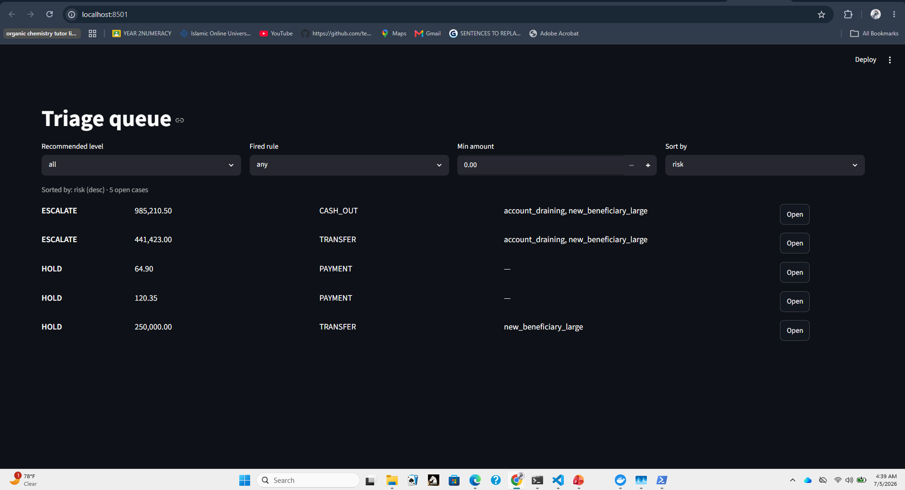
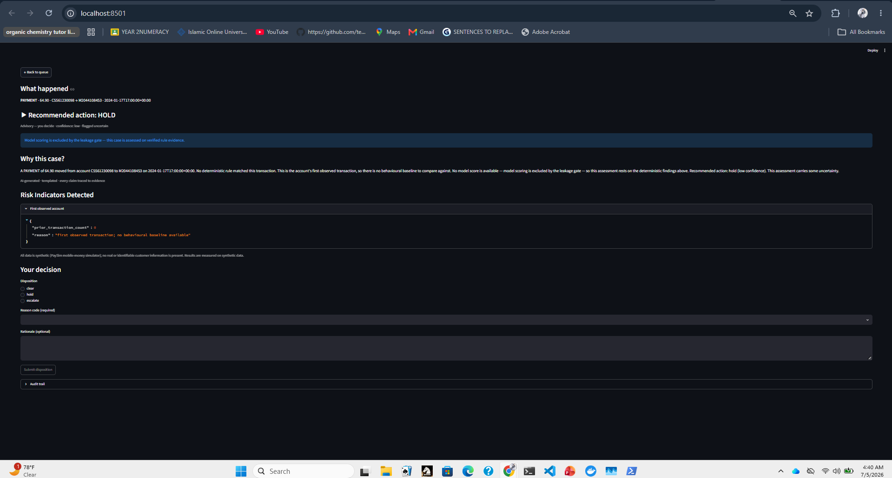
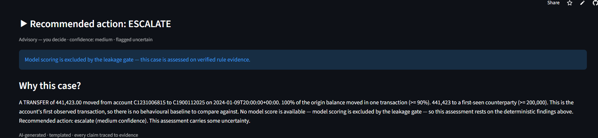
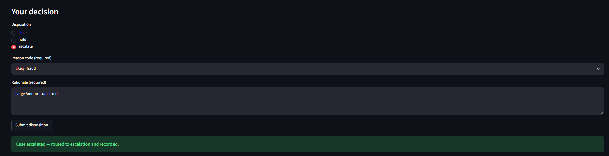
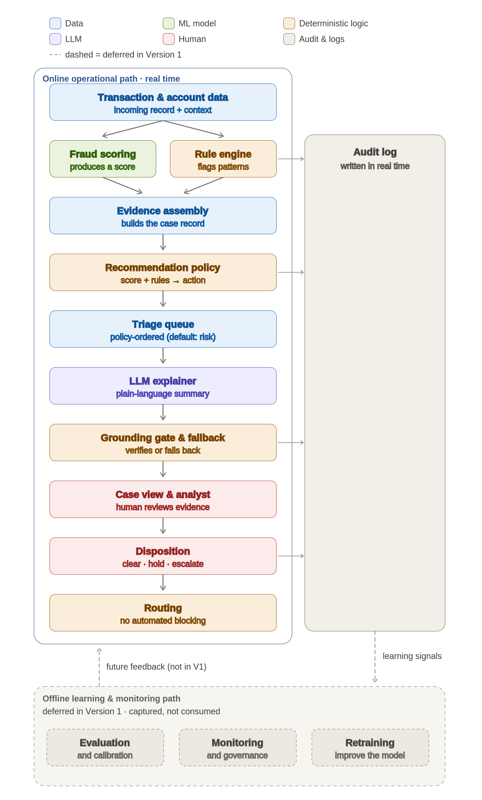

# AI Assisted Transaction Fraud Monitoring Platform

A governance first, human in the loop decision support system that helps fraud analysts investigate suspicious transactions through deterministic evidence, explainable AI recommendations, grounded explanations, complete auditability, and reproducible evaluation.

The platform demonstrates how trustworthy AI can support operational decision making without replacing human judgement. Every recommendation is explainable, every AI generated statement is grounded in evidence, and every analyst decision is recorded in a reconstructable audit trail.

| Resource | Link |
|----------|------|
| 🚀 **Live Demo** | https://transaction-fraud-monitoring.streamlit.app/ |
| 🔗 **API** | https://transaction-fraud-monitoring.onrender.com/docs |

| 📊 **Presentation** | *Add Google Slides link* |


## Product Preview

The screenshots below show the deployed analyst workspace used to triage suspicious transactions, investigate evidence, review AI assisted recommendations, and record auditable decisions.

| Analyst Queue | Case Investigation |
|---------------|--------------------|
|  |  |

| Recommendation & Explanation | Human Decision |
|------------------------------|----------------|
|  |  |


## Project Overview

Fraud analysts work a queue of alerts under time pressure. For each one they must
reconstruct context, weigh the signals, reach a defensible decision, and justify it
to managers, auditors, and regulators. The bottleneck is rarely the absence of a
score — it is the manual assembly of context and the consistency and defensibility
of the decision.

This platform is **decision support for that workflow**. It compresses the time
between an alert and a defensible disposition by assembling the evidence, applying
transparent rules, recommending an action, and explaining the risk in plain
language — while leaving the decision itself with the analyst. It is not an
autonomous fraud-blocking system, and it makes no automated operational decisions.

The central engineering problem is not prediction accuracy. It is building a system
whose outputs a professional can trust, inspect, override, and defend. That
requirement drove every architectural choice: layer separation, evidence grounding,
mandatory human disposition, and end-to-end auditability.

## Why this project

**Fraud monitoring is a decision-support problem, not a prediction problem.** A
model that emits a probability tells an analyst that something may be wrong, not
why, and not what to do about it. In a financial-crime context, an unexplained
score creates more work,  the analyst still has to assemble the context
and defend the call.

**Prediction alone is insufficient** because the consequential act — clearing,
holding, or escalating a customer's transaction carries accountability that cannot
be delegated to a black box. A wrong automated block harms a legitimate customer; a
wrong automated clear misses real fraud. Both demand a human who can see the basis
for the decision and take responsibility for it.

Once the human is correctly placed at the centre, **governance becomes the
architecture**. The hard problems are no longer "what is the AUC" but: How do we
guarantee an explanation never states something the evidence does not support? How
do we keep the model's output, the rules' output, the AI's narrative, and the
human's decision visibly distinct? How do we reconstruct exactly what an analyst saw
and decided, months later, from the record alone? Those questions shaped the system.

---

## Product Workflow

The platform supports the complete fraud analyst workflow:

1. Suspicious transaction enters the triage queue.
2. Analyst opens a case for investigation.
3. The system presents deterministic evidence and an AI-assisted recommendation.
4. Every explanation is grounded in recorded evidence.
5. The analyst reviews the evidence and records a disposition.
6. The decision is written to an append-only audit log.
7. Historical decisions can be reconstructed exactly as originally presented.


## Technology Stack

| Layer | Technology |
|--------|------------|
| Frontend | Streamlit |
| Backend | FastAPI |
| Database | PostgreSQL, SQLite |
| Machine Learning | XGBoost |
| AI | OpenAI-Llama LLM (optional, grounded) |
| ORM | SQLAlchemy |
| Testing | pytest |
| Deployment | Docker, Render, Streamlit Community Cloud |


---


## Key Features

- **Analyst triage queue** — a prioritised, re-sortable, filterable work queue.
  Ordering is a configurable operational policy (default: risk), visible and
  re-sortable — not a hidden property of a model score.
- **Deterministic fraud rules** — an auditable if-then rule engine (account
  draining, velocity, large transfer to a new beneficiary) whose parameters are
  versioned configuration, never literals in code. Each firing produces a `RuleHit`
  that carries the exact fields and thresholds that made it fire.
- **Recommendation policy** — a deterministic, **advisory** policy that maps rule
  evidence and score status to `clear` / `hold` / `escalate`. It is separate from
  the model and from the human; it recommends, it does not decide.
- **Grounded explanations** — a plain-language explanation of each case, produced by
  a templated explainer and verified by a deterministic **grounding gate**: every
  number and entity in the narrative must trace to a known evidence element, or the
  explanation is not shown.
- **Evidence inspection** — each risk indicator on the case screen expands to the
  raw underlying signal (e.g. fraction of balance moved, first-seen counterparty),
  so an analyst can drill from summary to source.
- **Human analyst workflow** — the disposition control renders with no default
  selection, every disposition requires a structured reason code (no one-click
  clear), and escalations or deviations require a fuller rationale. The human is the
  sole decider.
- **Audit logging** — an append-only audit log (no update, no delete). Each
  disposition writes one complete decision record.
- **Decision reconstructability** — a decision can be rebuilt from the audit log
  alone, by deserializing a typed, versioned snapshot — with no recomputation and no
  dependence on current configuration or business logic.
- **Offline evaluation** — a reproducible, one-command evaluation pipeline that
  consolidates model metrics, the leakage-gate verdict, and grounding integrity,
  labelling every number as *measured* or *modelled estimate*.
- **Cloud deployment** — the full stack runs from a single `docker compose up`
  (PostgreSQL, migrations, idempotent demo seeding, API, and workspace) or as local
  processes against SQLite.

---

## System Architecture

The system separates an **online operational path** (synchronous request/response,
serving one case to a disposition) from an **offline evaluation path** (reproducible,
run separately). The append-only audit log is the only bridge between them: written
by the online path, read by the offline path. Version 1 captures learning signals
but does not consume them — the feedback loop is deferred for version 2.

!| 🏗 **System Architecture** |  |

The online path composes a strict sequence of single-responsibility layers. No layer
absorbs another's responsibility:


---


## Installation

Requires **Python 3.11+**. The project uses [`uv`](https://github.com/astral-sh/uv)
for reproducible installs against the committed lockfile.

```bash
# clone
git clone https://github.com/OlawumiSalaam/transaction-fraud-monitoring
cd transaction-fraud-monitor

# install (runtime + dev tooling)
uv pip install --system ".[dev]"     # or: uv sync

# quality gates
ruff check src tests evaluation
ruff format --check src tests evaluation
mypy src/tfm evaluation

# tests
pytest
```


## Dataset

**Why PaySim.** The platform is built and evaluated on
[PaySim](https://www.kaggle.com/datasets/ealaxi/paysim1), a synthetic mobile-money
transaction simulator. Synthetic data satisfies the "no confidential or identifiable
customer information" constraint by construction — no real PII, no re-identification
risk — which makes an openly reviewable fraud project possible at all.


## Deployment

Both supported run paths launch the same analyst loop: triage queue → case →
recommendation → grounded/templated explanation → evidence drill-down → disposition
with mandatory rationale → routing → audit. The LLM is disabled by default, so the
stack runs on the templated (grounded) explanation floor with no external provider.

### Local (SQLite, no Docker)

Two processes against a local SQLite file. **Terminal 1** — migrate, seed, and serve
the API on `:8000`:

```bash
export DATABASE_URL="sqlite:///./tfm_demo.db"
export CONFIG_DIR=config
export LLM_ENABLED=false

python -m alembic upgrade head          # apply schema migrations
python scripts/seed_cases.py            # populate the queue (idempotent)
python -m uvicorn tfm.api.app:app --app-dir src --host 127.0.0.1 --port 8000
```

**Terminal 2** — the Streamlit workspace on `:8501`, pointed at the API:

```bash
export PYTHONPATH=src
export API_BASE_URL=http://localhost:8000

python -m streamlit run src/tfm/web/app.py --server.port 8501
```

Open <http://localhost:8501>.

### Docker Compose (PostgreSQL)

```bash
cp .env.example .env
docker compose up --build
```

The `db` service (PostgreSQL) comes up healthy; the `api` service **applies Alembic
migrations, runs the idempotent demo seed, then serves** on `:8000`; the `web`
service runs Streamlit on `:8501`. `docker compose up` alone produces a populated
queue — no manual seed step, and a second `up` skips re-seeding.

- Workspace: <http://localhost:8501>
- API health: <http://localhost:8000/health>

**A correct launch (either path):** the queue opens with 5 cases, the 2 escalate
cases on top (account draining + large transfer to a new beneficiary), then three
holds. An empty queue means the seed did not run against that database.


---

## 13. Limitations


- **PaySim simulator leakage.** The trained scorer's apparent performance depends on
  simulator balance artefacts and fails the leakage gate; it is therefore excluded
  from operational use. The system runs on deterministic rule evidence instead.
- **Limited behavioural history.** PaySim origin accounts are largely unique, so
  there is little per-account history to establish a behavioural baseline. Rules and
  features that depend on such history are implemented but under-exercised by this
  dataset.
- **Synthetic evaluation.** All reported model performance is measured on synthetic
  distributions and is a modelled estimate of real-world performance, not a
  production result. The model has not been exposed to real fraud diversity.
- **Deterministic rule coverage.** The V1 rule set is intentionally small and
  auditable (account draining, velocity, large transfer to a new beneficiary). A
  mule/pass-through rule is implemented behind the engine but not enabled, pending
  the peer evidence it requires; dormant-account reactivation is deliberately out of
  scope with no proxy.
- **No production hardening in scope.** Authentication, authorization, retention, and
  database-level append-only enforcement on the audit store are real-deployment
  obligations, documented and deferred (the application layer enforces append-only by
  construction today).

---

##  Future Work


- **Richer behavioural datasets** — a real or higher-fidelity behavioural simulator
  to exercise velocity, counterparty, and mule patterns the current dataset cannot.
- **Online feature store** — persistent, point-in-time behavioural profiles rather
  than per-request feature computation.
- **Streaming ingestion** — a real-time transaction ingestion path alongside the
  current batch/seed path.
- **Adaptive analyst feedback** — consuming the captured (but currently not consumed)
  audit signals to close the learning loop between the offline and online paths.
- **Additional rule families** — activating the mule/pass-through rule and adding
  further auditable typologies.
- **Production authentication & authorization** — real identity, session management,
  and access control on the audit store, with retention policy.
- **Observability** — operational metrics, tracing, and monitoring for the online
  path.
- **Continuous evaluation** — scheduled re-evaluation, calibration drift detection,
  and subgroup / false-positive-burden analysis as standing components.

---

## License

_
