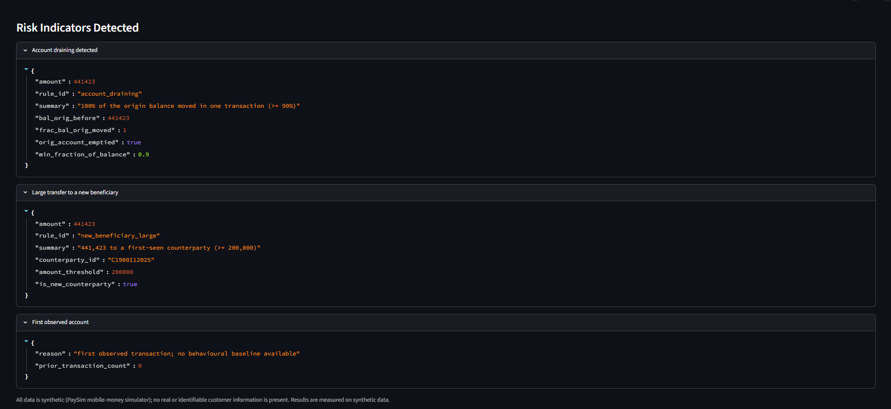

# Transaction Fraud Monitoring — Engineering Documentation

**Version 1 · definitive technical reference**

This document is the authoritative engineering description of the Transaction Fraud
Monitoring platform. It is written for AI researchers, senior ML engineers, software
architects, fraud-analytics professionals, technical reviewers, and future
contributors. It explains not only what the system does but why each architectural
decision was made, and it is grounded entirely in the committed repository: source
under `src/tfm/`, the offline evaluation package under `evaluation/`, the governance
configuration under `config/`, the approved specification under `docs/`, the
committed evaluation artifacts under `evaluation/reports/`, and the deployed
application.

Every quantitative claim is sourced from the committed evaluation artifacts and is
labelled *measured* or *modelled estimate*. All figures were produced on synthetic
PaySim data; no real-world performance is claimed anywhere in this document.

---

## Table of Contents

1. [Executive Summary](#1-executive-summary)
2. [Problem Context](#2-problem-context)
3. [Product Vision](#3-product-vision)
4. [System Overview](#4-system-overview)
5. [Dataset](#5-dataset)
6. [Machine Learning](#6-machine-learning)
7. [Rule Engine](#7-rule-engine)
8. [Evidence Assembly](#8-evidence-assembly)
9. [Explainability](#9-explainability)
10. [Analyst Workspace](#10-analyst-workspace)
11. [Audit and Governance](#11-audit-and-governance)
12. [Evaluation](#12-evaluation)
13. [Responsible AI](#13-responsible-ai)
14. [LLM and AI Usage and Disclosure](#14-llm-and-ai-usage-and-disclosure)
15. [Deployment](#15-deployment)
16. [Software Engineering](#16-software-engineering)
17. [Lessons Learned](#17-lessons-learned)
18. [Future Work](#18-future-work)
19. [References](#19-references)

---

## 1. Executive Summary

Fraud analysts do not lack scores. They lack the time and the defensible basis to
turn an alert into a decision they can justify to a manager, an auditor, or a
regulator months later. The bottleneck in transaction fraud monitoring is not
prediction; it is the manual assembly of context and the consistency and
defensibility of the disposition. This platform addresses that bottleneck directly.

**The problem.** For each flagged transaction an analyst must reconstruct what
happened, judge whether it is abnormal for the account, weigh the signals, decide to
clear, hold, or escalate, and record a rationale that survives later scrutiny. A bare
probability from a model helps with none of these steps.

**The product.** Transaction Fraud Monitoring is an AI-assisted case-investigation
workspace. For each flagged transaction it assembles the supporting evidence,
evaluates deterministic fraud rules, produces an advisory recommendation, and
generates a plain-language explanation that is verified against the evidence before
an analyst ever sees it. The analyst records the disposition — always with a
structured rationale — and the system writes a complete, reconstructable audit
record. It is a decision-support tool: **AI supports the decision; it never makes
it.** There is no automated blocking, denial, or account suspension.

**The engineering contribution.** During model development the scorer posted a
PR-AUC of 0.9983 on the out-of-time synthetic split. That number was not a success;
it was a symptom. A leakage gate built into the training pipeline showed that the
score was carried almost entirely by PaySim's balance-consistency artifacts —
bookkeeping side-effects of how the simulator reverses fraudulent transactions —
rather than by transferable behavioural signal. Under the project's eligibility
rule the model was excluded from operation. Because the architecture had always
treated the scorer as one replaceable input behind an interface, its exclusion was a
handled operating state rather than a failure of the product: the system continues to
assemble evidence, apply auditable rules, recommend, explain, and record decisions
without it.

The substantive contribution of this project is therefore not a fraud classifier. It
is a governance-first architecture in which model failure is an observable, handled
state: a leakage gate that can exclude a model from operation; a deterministic
grounding gate that prevents any generated explanation from asserting a fact the
evidence does not support; and an append-only audit layer from which any past
decision can be reconstructed exactly. Trustworthiness in this system is a property of
the architecture, not of the model.

---

## 2. Problem Context

### 2.1 Transaction fraud monitoring

A transaction fraud monitoring operation processes a continuous stream of alerts.
Some fraction of transactions are flagged — by upstream rules, models, or external
signals — and routed to human analysts who must decide what to do about each one.
The analyst's unit of work is the *case*: a single flagged transaction together with
whatever context can be assembled about it. The operational objective is a correct,
consistent, and defensible disposition for every case, produced quickly enough to
keep pace with the queue.

### 2.2 Why this is a decision-support problem, not a prediction problem

It is tempting to frame fraud monitoring as a classification task: given a
transaction, predict fraud or not. That framing is where much of the field
over-invests, and it is insufficient here for a structural reason.

The consequential act — clearing, holding, or escalating a customer's transaction —
carries accountability that cannot be delegated to an opaque score. A wrong automated
block harms a legitimate customer; a wrong automated clear misses real fraud. Both
outcomes demand a human who can see the basis for the decision and take
responsibility for it. A model that emits a probability tells an analyst *that*
something may be wrong, not *why*, and not *what to do about it*. In a financial-crime
context an unexplained score creates work rather than removing it, because the analyst
still has to assemble the context and defend the call.

Once the human is correctly placed at the centre of the decision, the hard
engineering questions change. They are no longer "what is the AUC?" They become:

- How do we guarantee an explanation never states something the evidence does not
  support?
- How do we keep the model's output, the rules' output, the AI-generated narrative,
  and the human's decision visibly and structurally distinct?
- How do we reconstruct exactly what an analyst saw and decided, months later, from
  the record alone?

Those questions shaped the system. The design philosophy is stated directly in the
repository README: *AI supports the decision; it never makes it.* Every consequential
action stays under human control, every generated claim is grounded in evidence, and
every decision is reconstructable from an append-only log.

### 2.3 Operational constraints

Several constraints follow from the operational reality and are treated as
first-class requirements rather than implementation details:

- **Time pressure.** Analysts work a queue. The product's value is measured by how
  much it compresses the time between an alert and a defensible disposition, not by a
  headline metric.
- **Defensibility.** Every decision must be justifiable after the fact to parties who
  were not present when it was made. This makes auditability and reconstructability
  non-negotiable.
- **Accountability.** Because the act is consequential, a human must remain the sole
  decider. Automated operational decisions are out of scope by design.
- **Explainability.** An explanation that cannot be trusted is worse than no
  explanation, because it invites a wrong decision made with false confidence. Any
  generated text must be constrained to what the evidence supports.

### 2.4 The analyst workflow

The workflow the product supports — and the end-to-end acceptance test the project is
defined against — is a single loop:

> Triage Queue → Open Case → Review Assembled Evidence → Review Recommendation and
> Basis → Review Grounded (or Templated) Explanation → Record Disposition with
> Mandatory Rationale → Route the Case

Every architectural decision derives backwards from this loop. A thinner product that
completes the loop faithfully is preferred to a set of polished components that never
connect.

### 2.5 Why explainability and governance matter

In a domain where decisions are consequential and reviewable, the credibility of the
system rests on three properties that a scoring model alone cannot provide:
transparency (the analyst can see and inspect the basis for every signal),
groundedness (no generated claim exceeds the evidence), and reconstructability (a past
decision can be reproduced exactly). These are governance properties, and in this
system they are implemented as architecture — enforced in code and in the database —
rather than offered as assurances. Chapters 9, 11, and 13 describe the mechanisms.

---

## 3. Product Vision

### 3.1 Intended users

The primary user is a **fraud analyst** working a prioritised queue of flagged
transactions. Secondary stakeholders are the managers, auditors, and regulators to
whom an analyst's decisions must later be justified; the product serves them through
its audit and reconstructability guarantees rather than through a direct interface.

### 3.2 Product goals

1. Compress the time between an alert and a defensible disposition by assembling
   evidence, applying transparent rules, recommending an action, and explaining the
   risk in plain language.
2. Keep the consequential decision with the human, and make that decision consistent
   and defensible.
3. Guarantee that every generated claim is grounded in recorded evidence and that
   every decision is reconstructable from an append-only log.
4. Remain fully functional with the optional LLM pathway disabled — graceful
   degradation is an architectural requirement, not a fallback of last resort.

### 3.3 Scope (Version 1)

Version 1 delivers the complete acceptance loop on real PaySim data:

- Ingestion of PaySim into a canonical schema, with point-in-time features and an
  out-of-time split.
- A machine-learning scorer trained and evaluated through a real interface, subject
  to a simulator-leakage gate.
- A deterministic rule engine with auditable rule firings.
- Evidence assembly answering seven defined evidence requirements, with an explicit
  groundable set.
- A deterministic recommendation policy mapping evidence to `clear` / `hold` /
  `escalate`.
- A templated explainer plus a deterministic grounding gate, with graceful fallback.
- A Streamlit analyst workspace over a FastAPI service: queue, case investigation,
  evidence drill-down, recommendation, explanation, disposition with mandatory
  rationale, and routing.
- An append-only audit log and single-event decision reconstruction.
- A reproducible offline evaluation package.

### 3.4 Out-of-scope functionality

The following are explicitly out of scope for Version 1 and are recorded as roadmap
items rather than silently omitted:

- **Automated operational decisions.** No automated blocking, denial, or suspension.
  This is a permanent design boundary, not a deferral.
- **Streaming ingestion (Kafka) and a caching tier (Redis).** Deferred; the
  architecture is streaming-ready (see Chapter 4 and Chapter 18).
- **A production LLM explanation pathway.** The LLM sits behind the real `Explainer`
  interface as a documented stub in V1; the templated floor ships.
- **Dormant-account reactivation detection.** Classified out of demonstrable V1 scope
  because PaySim's fraud typology and thin per-account histories cannot validate it;
  no proxy is carried forward.
- **Authentication and authorisation, search and filter, subgroup/false-positive
  fairness analysis, and threshold sensitivity analysis.** Deferred to the roadmap.

### 3.5 Assumptions

- The demonstration operates on synthetic transactions representative of PaySim
  scenarios; the scorer and its evaluation were produced from the full PaySim dataset
  offline. No claim is made that PaySim represents real-world fraud behaviour.
- Analysts are trusted domain professionals; the product optimises for their
  judgement rather than attempting to replace it.
- Governance parameters (thresholds, rule parameters, queue ordering, rationale
  depth) are owned by a governance role and expressed as versioned configuration, not
  code.

---

## 4. System Overview

### 4.1 Architecture

The system is organised as a set of layers with strictly separated responsibilities.
The central architectural invariant — enforced in code, not by convention — is **no
layer collapse**: the ML layer never decides; the recommendation policy never scores;
the LLM never scores or decides; only the human disposes. Every layer operates on a
single **Canonical Evidence Schema** so that no component depends on a private data
shape.

*Figure 4.1 — Reference architecture. The online operational path (real time) runs
top to bottom; the offline learning and monitoring path is captured but not consumed
in Version 1 (dashed). The audit log is written along the entire online path.*

### 4.2 Component responsibilities

| Layer | Module(s) | Responsibility | Never does |
|---|---|---|---|
| Ingestion | `data/ingest.py` | Map PaySim CSV into canonical `accounts`, `counterparties`, `transactions`; idempotent | Score, assemble, decide |
| Feature builder | `data/features.py` | Point-in-time interpretable features (`FEATURE_COLUMNS`) | Read future rows |
| ML scorer | `ml/` | Produce a calibrated probability through the `Scorer` interface | Recommend, decide |
| Rule engine | `rules/` | Evaluate deterministic if-then rules → `RuleHit` evidence | Use the ML score, decide |
| Evidence assembler | `assembly/assembler.py` | Build the `EvidencePackage` and the explicit groundable set | Score, recommend, explain, decide |
| Recommendation policy | `recommendation/policy.py` | Map (score band, rule hits) → `clear`/`hold`/`escalate`, advisory | Score, explain, route, decide |
| Explainer | `explanation/` | Turn evidence + recommendation into prose (templated or LLM) | Source evidence, score, decide |
| Grounding gate | `explanation/grounding.py` | Deterministically verify every generated claim traces to evidence | Be a model |
| Queue | `queue/ordering.py` | Order the work queue by a visible, configurable policy | Hide ordering in a score |
| Analyst workspace | `web/` | Present the loop; capture the disposition | Auto-execute a decision |
| Services | `services/` | Orchestrate case assembly, queue, and disposition | Collapse a layer |
| Audit | `audit/` | Append-only decision record and single-event reconstruction | Update or delete |
| Persistence | `persistence/` | SQLAlchemy 2.0 typed models and sessions | — |

The layer-separation rule is why the operational exclusion of the scorer (Chapter 6)
did not cascade into the rest of the product: every downstream layer depends on the
canonical schema and the `Scorer` *interface*, never on the model producing a value.

### 4.3 Request flow (online path)

The online path is served by a FastAPI application (`api/app.py`) whose routes map
onto the acceptance loop:

- `GET /health` — liveness and configuration status.
- `GET /api/queue` — the triage queue, ordered by the configured policy.
- `GET /api/cases/{case_id}` — the assembled case: evidence package, recommendation,
  and explanation.
- `GET /api/cases/{case_id}/evidence/{element_id}` — drill-down into a single
  groundable evidence element.
- `GET /api/cases/{case_id}/audit` — the case's audit trail.
- `POST /api/cases/{case_id}/disposition` — record the analyst's disposition and
  routing; writes the immutable decision snapshot.

For a single case the flow is: ingestion has already persisted canonical transactions;
the feature builder computes point-in-time features; the rule engine emits `RuleHit`s;
the scorer produces a score *status* (operationally an explicit exclusion, see Chapter 6);
the assembler builds the `EvidencePackage` and groundable set; the recommendation
policy maps the evidence to an advisory action; the explainer produces a templated
explanation that is grounded by construction; the analyst reviews the case in the
Streamlit workspace and records a disposition with a mandatory rationale; and the
disposition service writes a single `disposition_recorded` audit event carrying the
complete snapshot. The Streamlit workspace (`web/app.py`) is a thin client over these
API endpoints.

Application startup is fail-fast: invalid governance configuration aborts startup
(`api/app.py` lifespan), so the system never runs with an unvalidated policy.

### 4.4 Deployment model

The platform runs as two processes plus a database. A FastAPI online-path service
provides the decision API; a Streamlit application provides the analyst workspace and
calls the API; PostgreSQL holds the operational tables and the append-only audit log.
The three are wired with Docker Compose for local and single-host operation (`db`,
`api`, `web` services), and are deployed publicly with the FastAPI service on Render
and the workspace on Streamlit Community Cloud. Chapter 15 documents deployment in
detail.

The architecture is deliberately streaming-ready without shipping streaming
infrastructure. Ingestion is the seam for streaming: `data/ingest.py` is a source
adapter whose only contract is to produce canonical `Transaction` records into the
store, so a future Kafka consumer is another implementation of that same contract with
no downstream change. The persistence/repository layer is the seam for caching: a
Redis cache can be introduced behind a repository implementation without changing any
caller. Version 1 places these seams and deliberately omits the infrastructure.

---

## 5. Dataset

### 5.1 PaySim

The system is trained and evaluated on **PaySim**, a synthetic mobile-money
transaction simulator (Lopez-Rojas, Elmir, and Axelsson, 2016). The committed raw
file (`data/raw/PS_20174392719_1491204439457_log.csv`) contains **6,362,620
transactions** over **744 hourly steps** (approximately 31 days of simulation), with a
fraud prevalence of **0.13%** (8,213 fraudulent transactions). Each record carries
origin and destination account identifiers, transaction type and direction, balances
before and after on both sides, a time step, and a fraud label.

### 5.2 Why PaySim was selected

The single most consequential structural requirement of the product is
**account-linked, time-ordered transactions with a counterparty**. Without that
entity model there is no behavioural baseline, no velocity, no sequence, and no
mule-movement pattern to detect or to explain. PaySim is the most appropriate
schema-compatible public option against that requirement: it provides counterparty
linkage, transaction type and direction, both-side balances, a time step, and a fraud
label — a near-direct match to the required entities and contextually apt for the
transfer and mobile-money channels the product targets.

### 5.3 Alternative datasets considered

The dataset decision was made against explicit alternatives, and the rejections are
recorded because they are architectural, not incidental:

- **Card-purchase simulators (BankSim, Sparkov).** Customer-to-merchant, with no
  account balances and no peer-to-peer transfers. Mule movement and rapid
  fund-draining patterns are structurally inexpressible in them, so they cannot
  support the product's evidence model.
- **Anonymised public sets (ULB credit-card PCA features; IEEE-CIS).** Disqualified on
  interpretability and entity grounds: PCA-masked or opaque features provide no
  account identifier, no counterparty, and nothing a deterministic rule or a grounded
  explanation can refer to.
- **A hybrid / merged training set.** Rejected on architecture grounds — schema
  fragmentation and dataset-provenance leakage. The legitimate multi-dataset value
  (external validity, demographic-fairness testing) is routed to a separate-purpose
  Version 2 track rather than merged into the core training set.

### 5.4 Preprocessing and ingestion

Ingestion (`data/ingest.py`) maps PaySim column names onto the canonical schema;
derives an event timestamp from the PaySim step field against a fixed, documented
epoch; flags merchant destinations (the PaySim `nameDest` `M` prefix); nulls out
destination balances for merchant counterparties (a merchant carries no meaningful
balance signal); and persists accounts, counterparties, and transactions idempotently.

One preprocessing decision is a direct leakage control: PaySim's `isFlaggedFraud`
column (`sim_flagged` in the canonical schema) is ingested for provenance but is
**excluded from every feature**, to prevent trivial simulator leakage. This is
enforced at the schema spine (`schema/evidence.py`) rather than left to the training
code.

An operational memory-behaviour decision is also relevant to reproducibility. Because
PaySim's origin accounts are almost entirely unique, grouping by account produces on
the order of millions of groups; the point-in-time feature computation was therefore
implemented as a single linear pass over the frame after a stable sort by
`(account_id, event_ts)`, rather than a per-group materialisation that exhausted host
memory at full scale. The point-in-time invariant is unchanged; only the
implementation of the pass changed.

### 5.5 Canonical Evidence Schema

Every component — ingestion, feature engineering, the rule engine, the ML scorer, the
grounding layer, the case view, and the audit log — operates on a single **Canonical
Evidence Schema**. New datasets may be introduced only if they can either conform to
that schema without loss of meaning or remain isolated as separate-purpose evaluation
datasets. The canonical schema is never compromised to accommodate an additional
dataset.

The schema spine lives in `schema/evidence.py` and `schema/entities.py` and defines,
among others, the `FeatureVector` (the feature builder's output, shared verbatim by
the scorer, the rule engine, and the assembler), the `RuleHit` (a deterministic rule
firing), the `EvidenceElement` and `EvidencePackage` (the assembled case), and the
`ScoreStatus` together with the assembler's `score_signal` element (which carry the
score or its honest exclusion). A feature
that is predictive but not interpretable is disqualified, because the rule engine and
the grounding layer require every field to be human-readable.

### 5.6 Feature engineering

Features are interpretable and behaviourally grounded, and are computed strictly
point-in-time: the features for a transaction at time *t* use only data with an event
timestamp strictly before *t* within the same account. The ordered `FEATURE_COLUMNS`
(from `data/features.py`) span four families:

- **Transaction-intrinsic:** `amount`, and one-hot transaction types (`type_payment`,
  `type_transfer`, `type_cash_out`, `type_cash_in`, `type_debit`).
- **Balance/sequence:** `bal_orig_before`, `bal_orig_after`, `frac_bal_orig_moved`,
  `orig_account_emptied`.
- **Counterparty:** `is_new_counterparty`, `distinct_counterparties_seen`.
- **Account-behavioural (trailing windows):** `txn_count_24h`, `amount_sum_24h`,
  `amount_to_prior_mean_ratio`, `amount_to_prior_max_ratio`, `hours_since_last_txn`.

Two derived column sets are defined for the machine-learning work and are central to
the leakage story in Chapter 6:

- `PRIMARY_FEATURE_COLUMNS` = `FEATURE_COLUMNS` minus the four balance-artifact
  features (`bal_orig_before`, `bal_orig_after`, `frac_bal_orig_moved`,
  `orig_account_emptied`). This is the substrate the interpretable primary scorer is
  permitted to learn from once the leakage quarantine is applied.
- `COMPARATOR_FEATURE_COLUMNS` = `FEATURE_COLUMNS` plus the augmented
  destination-balance features (`bal_dest_before`, `bal_dest_after`), available only
  to the LightGBM "kitchen-sink" comparator.

Note that the balance/sequence features are used *legitimately* by the deterministic
rule engine (for example `frac_bal_orig_moved` for account draining); the leakage
quarantine applies only to what the ML scorer is allowed to *learn*, not to what a
transparent, inspectable rule may read. This distinction is developed in Chapters 6
and 7.

### 5.7 Synthetic demonstration cases

The live workspace is demonstrated on a small set of curated synthetic transactions
representative of PaySim scenarios, while the scorer and its evaluation were produced
from the full PaySim dataset offline. The curated demonstration cases are QA
fixtures; they are strictly excluded from any training or evaluation data. Every case
screen carries a synthetic-data disclosure, and that disclosure is display-only — it
is never treated as groundable evidence.

### 5.8 Assumptions, limitations, and bias

The dataset limitations are stated openly because they bound what any metric can
mean:

- **Single context, narrow typology.** PaySim's fraud typology is chiefly
  transfer/cash-out draining; some target patterns (dormant-account reactivation in
  particular) are weakly represented and are excluded from V1 scope.
- **Thin per-account history.** Approximately **99.85%** of accounts in the dataset
  appear only once, so the behavioural history the product is designed around barely
  exists in this data. This directly caps behavioural model performance (Chapter 6)
  and is the honest reason the behavioural ceiling is low.
- **Clean labels.** Synthetic labels make evaluation optimistic relative to the
  ambiguity of real fraud labelling.
- **Short span.** The ~31-day window limits any assessment of seasonality or drift.
- **Representativeness bias.** The synthetic distribution differs from real fraud; the
  disclosures address this and it cannot be closed without real data.
- **Group fairness.** PaySim carries no protected attributes, so the product cannot
  directly assess demographic fairness in Version 1, and no proxy is manufactured to
  pretend otherwise.
- **Simulator-learnability risk.** The balance-update artifacts can nearly separate
  fraud on their own; this is the risk the leakage gate exists to catch, and it caps
  how far any headline metric can be trusted as a real-world indicator.

The defensible realism claim is therefore narrow and stated as such: *PaySim provides
the entity structure and behavioural patterns required to support the product's
workflow, while Version 1 cannot establish how well those patterns represent
real-world fraud behaviour.*

---

## 6. Machine Learning

### 6.1 The scorer and its interface

The scorer is one input to the decision system, accessed through a real `Scorer`
interface (`ml/`). This interface commitment is what makes the model replaceable and,
ultimately, excludable without disturbing any other layer. The scorer's job is to
produce a calibrated probability; it never recommends, explains, or decides.

### 6.2 Candidate comparison

Model selection was a bounded comparison of three candidates trained and evaluated on
the same out-of-time split (`ml/candidates.py`, `ml/train.py`):

- **`histgb_interpretable`** — a histogram gradient-boosted model over the
  interpretable feature substrate; the intended primary.
- **`lightgbm_kitchen_sink`** — a LightGBM model over `COMPARATOR_FEATURE_COLUMNS`,
  including the augmented destination-balance features; the deliberately
  over-provisioned comparator used to probe how much apparent performance comes from
  balance signals.
- **`logistic_floor`** — a logistic-regression floor providing a simple baseline.

The comparison is honest and reported; interpretability is a selection criterion, not
an afterthought, because the model's fields must be readable by the rule and grounding
layers.

### 6.3 Point-in-time correctness

Feature computation is strictly point-in-time (Chapter 5.6). This is an architectural
invariant, not a training convenience: a feature that aggregates over time must never
incorporate information from at or after the transaction it describes. The invariant
is property-tested (features never read a future row).

### 6.4 Out-of-time validation

Random train/test splits are prohibited. The only permitted split is temporal
(`data/splits.py`): train on the earlier window, calibrate on a middle window, and
evaluate out-of-time on the later window that the model never saw during training.
PaySim's 744 steps are partitioned by fixed, reproducible boundaries from
`config/model.yaml`: `train_end_step = 500`, `val_end_step = 580`, with the test
window running to step 744. Because the boundaries are constants rather than random
seeds, the split reproduces from the data file alone.

### 6.5 Calibration

Probability calibration (`ml/calibration.py`) is governed by
`config/model.yaml → calibration`. The policy is `method: auto`, which chooses between
isotonic and sigmoid (Platt) calibration by validation Brier score, with a guard
(`min_fraud_for_isotonic: 500`) against isotonic overfitting when the validation fold
holds too few fraud rows. Calibration matters because the recommendation policy maps
score *bands* to actions; a score must mean what it claims for those bands to be
meaningful.

### 6.6 The leakage investigation

During development the interpretable model — trained at that point on the full feature
set including the balance-artifact features — posted a headline **PR-AUC of 0.9983**
on the out-of-time synthetic split (committed artifact
`evaluation/reports/tfm-scorer-20260703224313_training_report.json`). A PR-AUC of that
magnitude on a 0.13%-prevalence fraud problem is not a plausible behavioural result;
it is a signal to investigate the data-generating process.

The cause is a property of PaySim. The simulator cancels a fraudulent transaction
after flagging it, reversing the money, so the account balances themselves encode
which transactions were fraudulent. A model given the balance-artifact features can
therefore separate fraud almost perfectly by reading a bookkeeping side-effect rather
than by learning transferable behavioural patterns.

### 6.7 The leakage gate

The leakage gate (`evaluation/leakage_gate.py`) is the progression criterion for model selection. It
answers one question: has the model learned behavioural fraud patterns, or merely
bookkeeping artifacts? Its verdict is **evidence-based**, assembled from three strands
rather than a single threshold:

1. **Ablation.** Retrain the same architecture with the balance-artifact features
   removed and measure the PR-AUC delta.
2. **Feature-importance inspection.** Compute permutation importances of the full
   model and observe whether the balance-artifact features dominate.
3. **Remaining behavioural performance.** Measure the ablated model's absolute PR-AUC
   to see whether genuine behavioural signal survives without the artifacts.

The numeric thresholds are configurable **decision-support defaults**
(`config/model.yaml → leakage_gate`: `importance_repeats: 5`,
`min_behavioural_pr_auc: 0.50`, `max_ablation_pr_auc_delta: 0.20`). They support the
verdict but do not define it — the full evidence and a human-readable rationale are
always recorded, so a reviewer may disagree with a default without the gate silently
flipping.

For the model that posted 0.9983, the recorded verdict is **FAIL**: the
balance-artifact features held **98.5%** of total permutation importance, and ablating
them collapsed behavioural performance to a remaining **PR-AUC of 0.3365** (an
ablation delta of **0.6626**). The 0.9983 was not skill; it was an artifact of how the
data was generated.

### 6.8 The behavioural-augmentation experiment

The `lightgbm_kitchen_sink` comparator exists to quantify the balance-signal
contribution directly. It was given the augmented destination-balance features
(`bal_dest_before`, `bal_dest_after`) on top of the full feature set. Its committed
result (`tfm-scorer-20260704053632_training_report.json`) is likewise a leakage
**FAIL**: balance-artifact features held **65.7%** of permutation importance, and
ablation collapsed its behavioural PR-AUC from 0.2187 to **0.0353** (delta 0.1834).
The kitchen-sink model did not rescue behavioural performance; it confirmed the
dependence on balance signals. The interpretability decision recorded in the same
report retains the interpretable primary rather than the kitchen-sink comparator.

### 6.9 The governance decision: why the scorer is excluded operationally

Once the balance-artifact features are quarantined (`PRIMARY_FEATURE_COLUMNS`), the
interpretable model's honest behavioural performance is what remains. The committed
selected model (`tfm-scorer-20260704053632`) posts a modelled-estimate **PR-AUC of
0.3209** and a remaining behavioural **PR-AUC of 0.3369** — below the 0.50
decision-support floor — so its leakage verdict is **FAIL** and it is **ineligible**
for operation. The evaluation manifest records `scorer_eligible: false` and
`leakage_verdict: "fail"`.

The consequence is a governance decision, not a bug: **the operational path runs with
the scorer excluded.** The recommendation policy runs on rule evidence alone, and — as
Chapter 7 describes — never returns `clear`, because a clear would assert a
low-risk assurance the excluded scorer cannot provide. This is the point at which the
architecture earns its design: because the scorer was always one input behind an
interface, excluding it is a handled operating state that leaves the rest of the
product fully functional. Reintroducing an eligible scorer later flips a score-status
flag and activates the present-score path with no change to the policy or any other
layer.

The project's fixed rule is that this gate does not flex: a leaking model is never
presented as production-ready to meet a deadline, and if remediation is impossible
within the window the failure ships documented, with the ablation evidence presented
and remediation named as future work.

---

## 7. Rule Engine

### 7.1 Deterministic rules

The rule engine (`rules/definitions.py`, `rules/engine.py`) evaluates auditable
if-then rules over the shared canonical feature substrate. Each rule definition is a
pure function `(FeatureVector, params) -> RuleHit | None` with no probabilistic step
and no dependence on the ML score. Rule logic contains no literals; every parameter
comes from `config/rules.yaml`. A firing produces a `RuleHit` carrying the exact
fields and thresholds that made it fire, which is what makes rule evidence auditable.

The three enabled rules are:

- **`account_draining`** — fires when a large fraction of the origin balance moves in
  a single transaction (`min_fraction_of_balance: 0.9`). This is PaySim's signature
  draining pattern, and it legitimately reads the balance/sequence feature
  `frac_bal_orig_moved`.
- **`velocity`** — fires on a transaction-count spike in the trailing window
  (`window_hours: 24`, `max_transactions: 10`).
- **`new_beneficiary_large`** — fires on a large amount to a first-seen counterparty
  (`amount_threshold: 200000`).

Two further definitions are documented and deliberately not enabled:
`mule_passthrough` (an inbound-then-outbound signature) is retained as an
extension-point stub because it needs cross-transaction peer evidence that only the
assembler supplies, and dormant-account reactivation is absent because it is out of
V1 scope with no proxy carried forward.

### 7.2 Balance signals in rules versus in the model

The rule engine reads balance/sequence features that the ML scorer is forbidden to
learn from. This is not a contradiction; it is the core of the governance argument. A
balance-derived signal a model must not *learn* — because a learned dependence is
opaque and rides a simulator artifact — is perfectly legitimate in a hand-authored
rule, because the rule is inspectable: an analyst can see that "100% of the origin
balance moved in one transaction (≥ 90%)" and judge it on its face. Transparency, not
the feature itself, is the deciding property.

### 7.3 Recommendation policy

The recommendation policy (`recommendation/policy.py`) is a pure, deterministic,
**advisory** mapping from the score band plus the fired rule hits to a suggested
action. It never decides, scores, explains, ranks, or routes. It runs in one of two
paths behind a single architecture:

- **Absent-score path (operational).** While the scorer is gate-ineligible, the policy recommends solely from rule evidence and **never returns `clear`**.
  An escalating rule → `escalate`; any other fired rule → `hold`; no rule hits →
  `hold` with an uncertainty flag set. The score band is `none`. The escalating-rule
  set comes from `config/thresholds.yaml → recommendation.escalating_rules`, which in
  V1 contains `account_draining`.
- **Present-score path (future-ready).** The standard (score-band × rule-signal)
  mapping, taking the most severe of the score and rule signals, with borderline
  flooring at `hold`. Score bands come from `config/thresholds.yaml` (`low_max: 0.30`,
  `high_min: 0.80`). Introducing an eligible scorer flips the score status and
  activates this path with no policy change.

The recommendation carries its basis (score band plus the rule ids that contributed)
and an uncertainty flag, so the analyst always sees why an action was suggested.

### 7.4 Governance decisions and rationale

Two governance decisions in this layer are worth stating explicitly. First, *enabled*
means available for evaluation, not "drives a recommendation": rule hits are evidence,
the policy maps them to a suggestion, and the human disposes. Whether the supplied
dataset actually exercises a given enabled rule is a documented dataset property,
separate from whether the rule is implemented. Second, the refusal to `clear` on the
absent-score path is a deliberate safety property: with no trustworthy score the
system can raise concern but must not certify a transaction as safe.

---

## 8. Evidence Assembly

### 8.1 The evidence schema

The assembler (`assembly/assembler.py`) builds the `EvidencePackage` — the assembled
case — and defines the explicit **groundable set**: the subset of evidence elements
that a generated explanation is permitted to cite. Its contract is narrow: it
*assembles*. It does not score, recommend, explain, rank, or decide. Every emitted
`EvidenceElement` traces to a canonical field, a rule hit, or a score signal; this is
the total-traceability invariant.

### 8.2 The seven evidence requirements

The package answers seven defined evidence requirements, each with a named source:

1. **What happened** — transaction facts (amount, timestamp, type, origin,
   counterparty).
2. **Why it was flagged, in human terms** — interpretable feature fields plus rule
   hits.
3. **Whether it is abnormal for this account** — the account's prior history, or an
   explicit no-baseline element when there is none.
4. **The broader pattern** — counterparty linkage.
5. **Direction and balances** — transaction direction and both-side balances.
6. **Risk score** — the score, or its honest exclusion.
7. **Synthetic-data disclosure** — a display-only disclosure, never groundable.

### 8.3 Evidence packages and honest degradation

The package is designed to degrade honestly. When the scorer is excluded, requirement
6 is a populated `score_signal` element that carries the exclusion reason but no
probability — so no score value traces to any element, and a score claim in an
explanation is *structurally* ungroundable. When an account is first-observed,
requirement 3 is an explicit no-baseline element whose stated reason is itself
groundable. The system therefore never has to fabricate a baseline or a score to fill
a slot; the absence is represented as evidence.

### 8.4 Provenance and traceability

Because every element traces to a canonical field, a rule hit, or a score signal, the
evidence package is fully provenanced. The groundable classification is documented and
tested: transaction facts, direction and balances, interpretable features, account
history (or the no-baseline reason), counterparty linkage, rule hits, and the score
signal (including its exclusion reason) are groundable; the synthetic-data disclosure
is not. This groundable set is the contract the grounding gate checks against
(Chapter 9), and it is part of the immutable snapshot the audit log stores
(Chapter 11).

The workspace lets an analyst drill from a summary risk indicator to the raw
underlying signal. The screenshots in Chapter 10 show the collapsed indicators and
their expanded JSON, in which each indicator carries its `rule_id`, the raw fields
(for example `frac_bal_orig_moved: 1`, `orig_account_emptied: true`), and the
threshold that fired it (`min_fraction_of_balance: 0.9`).

---

## 9. Explainability

### 9.1 Templated explanations

The default explainer is the `TemplatedExplainer` (`explanation/templated.py`). Every
sentence is generated from a named groundable `EvidenceElement`, or from the
recommendation (which itself traces to elements). Numbers are rendered losslessly and
entities are copied verbatim from the elements, so every factual claim is
reconstructable from the assembled evidence. The templated explanation is therefore
**grounded by construction** and provably passes the grounding gate, which it
consequently bypasses. It explains the assembled evidence and the recommendation — not
model internals, since the scorer is operationally excluded.

### 9.2 The optional LLM pathway

The system defines an `LLMExplainer` (`explanation/llm_explainer.py`) behind the same
`Explainer` interface. In Version 1 it is a documented stub: when invoked it raises
`LLMUnavailable`, which drives the orchestrator to the templated fallback, exercising
and proving the graceful-degradation path. When enabled in a future version it would
render the groundable evidence into prose under a constrained, evidence-scoped prompt,
and its output would be verified by the deterministic grounding gate before any human
saw it. Upgrading to a real provider is a configuration and implementation change
behind the interface, not an architectural change.

### 9.3 Grounding

Grounding is the property that a generated explanation asserts nothing the evidence
does not support. It is enforced structurally: the LLM pathway is constrained to the
groundable set, and its output must pass a deterministic gate before display.

### 9.4 The grounding gate

The grounding gate (`explanation/grounding.py`) is deterministic code — **never a
model**. It builds a reference set from the case's groundable evidence elements plus
the recommendation's controlled vocabulary, then verifies that every factual token in
a generated narrative traces to that set:

- **Numbers** (amounts, percentages, counts, thresholds) are checked after canonical
  normalization — stripping `$` and thousands separators and mapping `%` to a fraction
  — so that `"$441,423.00"` equals `441423.0` and `"90%"` equals `0.9`.
- **Entities and controlled terms** (account, counterparty, and transaction ids;
  transaction types; rule identifiers; model version ids; the model-exclusion marker; and the
  recommendation's action, confidence, and score band) are checked by masking grounded
  strings first and then treating any residual id-, type-, or rule-shaped token as an
  ungrounded violation.

A `pass` implies that every numeric and entity token in the narrative is present in
the reference set. On failure the orchestrator falls back to the templated
explanation. This gate is the mechanism that makes it *structurally impossible* for an
explanation to invent a score that does not exist: when the scorer is excluded, there
is no score value in the reference set, so any sentence asserting one fails the gate.

### 9.5 Graceful degradation

Graceful degradation is an architectural requirement, not a fallback of last resort.
The fallback contract is explicit: if the LLM is disabled, unavailable, or its output
fails grounding, the templated explanation is returned. There is no error path for LLM
issues — an LLM failure never surfaces to the analyst as an error. The product remains
fully functional with the LLM disabled, and the committed evaluation confirms this
(Chapter 12): with the LLM disabled the templated fallback rate is 1.0 and the
ungrounded-statement rate is 0.

---

## 10. Analyst Workspace

The workspace (`web/app.py`, `web/render.py`) is a Streamlit application over the
FastAPI service. It presents the acceptance loop and captures the disposition; it
never auto-executes a decision. Generated text is labelled as AI-generated, model
outputs and rule outputs and human decisions are visually distinct, and synthetic data
is disclosed.

### 10.1 Triage queue

*Figure 10.1 — The triage queue.* The queue is ordered by a configurable operational
policy that defaults to risk (`config/queue_policy.yaml`: `default_sort: risk`,
`allowed_sorts: [risk, case_age]`, `order: desc`). The ordering basis is visible and
re-sortable — it is an operational decision, not a hidden property of a model score.
Each row shows the recommended level (for example `ESCALATE`, `HOLD`), the amount, the
transaction type, and the rule(s) that fired (for example `account_draining`,
`new_beneficiary_large`), with a control to open the case.

### 10.2 Case investigation

*Figure 10.2 — The case investigation screen.* The case opens with "What happened"
(the transaction facts), the recommended action with its advisory framing, and — when
the scorer is excluded — an explicit banner stating that model scoring is excluded by
the leakage gate and that the case is assessed on verified rule evidence. Below sit
the grounded explanation, the risk indicators, the synthetic-data disclosure, and the
disposition control.

### 10.3 Evidence inspection

*Figure 10.3 — Evidence drill-down.* Each risk indicator expands from a one-line
summary to the raw underlying signal: the `rule_id`, the exact fields that fired it,
and the governing threshold. The panel shown expands `account_draining` (amount
441,423; `frac_bal_orig_moved: 1`; `orig_account_emptied: true`;
`min_fraction_of_balance: 0.9`), `new_beneficiary_large` (`amount_threshold: 200000`;
`is_new_counterparty: true`), and a first-observed-account element
(`prior_transaction_count: 0`). This is the traceability of Chapter 8 made visible: an
analyst can move from summary to source for every signal.

### 10.4 Recommendation and explanation

*Figure 10.4 — Recommendation and grounded explanation.* The recommendation is
labelled advisory ("Advisory — you decide"), carries a confidence and an uncertainty
flag, and states its basis. The "Why this case?" narrative is the grounded
explanation; it is labelled "AI-generated · templated · every claim traced to
evidence", and — because the scorer is excluded — it states plainly that no model
score is available and that the assessment rests on the deterministic findings.

### 10.5 Disposition

*Figure 10.5 — The disposition workflow.* The disposition control renders with **no
default selection**; the analyst must actively choose `clear`, `hold`, or `escalate`.
A structured **reason code is required** and — for escalations and for any deviation
from the recommendation — a fuller rationale is required
(`config/governance.yaml`). There is no one-click clear. On submission the case is
routed (an escalation carries the case forward; a hold pends) and the outcome is
recorded, as shown by the "Case escalated — routed to escalation and recorded"
confirmation.

### 10.6 Audit and reconstructability

The case screen exposes the case's audit trail, and the disposition writes the
immutable decision snapshot described in Chapter 11. Any past decision can be
reconstructed exactly from that record alone.

---

## 11. Audit and Governance

### 11.1 Append-only audit

The audit log (`audit/log.py`, table `audit_log`) is append-only. The `AuditWriter`
exposes an `append` operation and nothing else — no update, no delete. The guarantee
is enforced at three levels: the application writer, a PostgreSQL trigger created by
the initial migration, and, in production, revocation of `UPDATE`/`DELETE` at the
database role level. The per-case events are `case_assembled`,
`explanation_generated`, and `disposition_recorded`.

### 11.2 The decision snapshot

At disposition the system writes a single `disposition_recorded` event carrying a
complete, self-contained, versioned, immutable snapshot (`audit/snapshot.py`): what
was shown (the rendered `EvidencePackage`), what was decided (the `DispositionSnapshot`
— action, reason code, rationale, and whether the analyst deviated from the
recommendation), what was recommended (the `Recommendation`), what was explained (the
`Explanation`), how it was routed (the `RoutingSnapshot`), and provenance.

A deliberate design choice is to snapshot the *rendered* artifacts rather than the
inputs plus configuration. Templated copy, rule parameters, and thresholds may change
over time; re-deriving a past decision from inputs and today's configuration would
reproduce today's output, not what the analyst actually saw. Storing the rendered
package, recommendation, and explanation makes reconstruction immune to any future
change in decision logic.

### 11.3 Reconstructability

Reconstruction (`audit/reconstruct.py`) reads a single `disposition_recorded` row and
validates its snapshot back into typed objects. It is **pure deserialization**: it
invokes no rule engine, no recommendation policy, no explanation generation, no
grounding gate, and no configuration, and it reads no operational table. The audit log
is the sole source. This is what makes a decision reconstructable after the fact even
if the decision logic later changes — a property verified by dedicated tests.

### 11.4 Rationale requirements

Every disposition — including a routine clear — requires at least a structured reason
code. This **engagement floor** is an architectural invariant enforced by the
Disposition Service and a database `NOT NULL` constraint; it is deliberately not
configurable and is not represented in `governance.yaml`. What `governance.yaml`
configures is only the depth *above* the floor: which actions require a richer
structured rationale (`richer_rationale_required_for_actions: [escalate]`) and whether
deviating from the recommendation requires one
(`richer_rationale_required_on_deviation: true`). A one-click clear is impossible by
construction.

### 11.5 Governance philosophy

Governance in this system is architecture, not documentation. Its parameters never
appear as literals in business logic; thresholds, rule parameters, queue ordering, and
rationale depth all live in versioned configuration under `config/`, and invalid
configuration fails startup. The invariants — no layer collapse, deterministic
grounding gate, append-only audit, no pre-selected disposition, the rationale
engagement floor, point-in-time features and out-of-time splits, and the
balance-artifact quarantine behind the leakage gate — are enforced in code and in the
database, and are not relaxed for convenience.

---

## 12. Evaluation

### 12.1 Methodology

Evaluation is offline and reproducible. A single command
(`python -m evaluation.run_all`) consolidates the submission's evidence into
`evaluation/reports/`. The runner **reads the committed model-training artifacts verbatim** — it
does not retrain, recalibrate, or regenerate any model metric. Model metrics,
eligibility, and the model version come from the committed scorer manifest; the full
leakage verdict comes from `evaluation/reports/leakage_verdict.json`; only the
grounding report, which is genuinely measurable on synthetic cases, is computed fresh.
Every number is labelled *measured* or *modelled estimate*, and nothing in the
evaluation feeds back into the online path.

Model evaluation uses PR-AUC, precision, and recall as primaries (appropriate under
heavy class imbalance), with ROC-AUC as a secondary, on the out-of-time split.

### 12.2 The leakage verdict

The headline of the evaluation is the leakage verdict, surfaced alongside the model
metrics so that the failure cannot be missed. For the committed selected model
(`tfm-scorer-20260704053632`) the verdict is **FAIL** and `scorer_eligible` is
**false**. The recorded rationale is that behavioural performance
collapses without the balance artifacts (remaining PR-AUC 0.3369, below the 0.50
decision-support floor). The earlier model that first exposed the problem
(`tfm-scorer-20260703224313`) recorded the dependence directly: balance-artifact
features held 98.5% of permutation importance and ablation collapsed PR-AUC from
0.9983 to 0.3365 (delta 0.6626). The kitchen-sink comparator likewise failed
(importance share 65.7%; ablated PR-AUC 0.0353).

### 12.3 Measured versus modelled metrics

The distinction is stated on every figure. Model metrics are a **modelled estimate**
on synthetic PaySim — they are not a production result, and the model they describe is
ineligible for operation. The committed summary reports, for the selected model, a
modelled-estimate PR-AUC of 0.3209, precision 0.9756, recall 0.1792, ROC-AUC 0.9174,
and a calibrated Brier of 0.0086 — all explicitly labelled as modelled estimates and
all attached to a model whose verdict is FAIL. What is **measured** on the shipped
product is the governance behaviour, not a predictive metric.

### 12.4 Grounding evaluation

Grounding is measured on a held-out sample of synthetic PaySim-shaped cases
(`evaluation/reports/grounding_report.json`). With the LLM disabled (the V1 floor),
the results are: ungrounded-statement rate **0.0**, total ungrounded tokens **0**, and
templated fallback rate **1.0** across the sampled cases. These confirm the two
architectural claims of Chapter 9 — that the templated floor emits no ungrounded
claim, and that the system runs fully on the templated pathway with the LLM off.

### 12.5 Reproducibility

Every offline artifact is reproducible from a single command, and the split, seed, and
gate defaults are fixed configuration (`config/model.yaml`: `seed: 42`, fixed step
boundaries). The evaluation manifest (`evaluation_manifest.json`) is the single source
of truth listing the consolidated artifacts, so downstream packaging references no
hardcoded filenames.

### 12.6 Honest limitations of the evaluation

The evaluation is bounded by the dataset (Chapter 5.8). The behavioural ceiling of any
model on this data is low — on the order of PR-AUC 0.34 — chiefly because roughly
99.85% of accounts appear only once, so the behavioural history the product is built
around barely exists. Clean synthetic labels make the evaluation optimistic; the
absence of protected attributes prevents any demographic-fairness assessment; and the
short span prevents any drift assessment. These limits are reported, not hidden.
Naming what the data cannot demonstrate is treated as part of a trustworthy
evaluation.

---

## 13. Responsible AI

Responsible-AI properties in this system are enforced, not asserted. Each maps to a
concrete mechanism documented above.

- **Human-in-the-loop.** The analyst is the sole decision authority. There is no
  automated block, clear, or suspension. The disposition control has no default
  selection (Chapter 10 and Chapter 11).
- **Recommendation versus decision.** The recommendation policy advises; it never
  decides, and on the absent-score path it can raise concern but never certify a
  transaction as safe (`clear` is structurally unavailable) (Chapter 7).
- **Transparency.** Model outputs, deterministic rule outputs, AI-generated text, and
  human decisions are visibly and structurally distinct; generated text is labelled
  and synthetic data is disclosed (Chapter 10).
- **Accountability.** Every disposition requires a structured rationale, with richer
  rationale for escalations and deviations; a one-click clear is impossible (Chapter 11).
- **Auditability.** The audit log is append-only, enforced at the application,
  trigger, and database-role levels (Chapter 11).
- **Reconstructability.** Any past decision reconstructs exactly from the audit log
  alone, by pure deserialization (Chapter 11).
- **Groundedness.** No ungrounded explanation reaches an analyst; the grounding gate is
  deterministic code, and the templated floor is grounded by construction (Chapter 9).

The honest limitations are equally part of responsible practice. The model is ineligible
and excluded; the metrics are modelled estimates on synthetic data; demographic fairness
cannot be assessed on PaySim; and the behavioural ceiling on this data is low. The system
states these facts about itself rather than obscuring them — including, on the case screen
itself, that model scoring is excluded by the leakage gate.

---

## 14. LLM and AI Usage and Disclosure

This chapter discloses, in full, how large language models and AI tools are used both
*within the product* and *in the development of the project*, and how that usage
complies with the challenge's LLM/AI-usage and responsible-AI rules. It complements
Chapter 9 (Explainability) and Chapter 13 (Responsible AI); cross-references are used
in place of repetition.

### 14.1 LLMs within the product

The product has exactly one LLM-eligible surface: the **explanation pathway**,
implemented as `LLMExplainer` behind the shared `Explainer` interface (Chapter 9). In
Version 1 the LLM is a **documented stub, disabled by default** (`LLM_ENABLED` is
false): when invoked it defers, and the deterministic `TemplatedExplainer` produces the
analyst-facing text. Consequently the shipped product **invokes no LLM at runtime** —
every analyst-facing sentence is deterministic, templated prose that is grounded by
construction.

Mapping the challenge's permitted LLM uses onto this product:

| LLM use (per brief) | In this product |
|---|---|
| Chat interaction | Not used. |
| Recommendation generation | **Not an LLM.** The recommendation is a deterministic policy over rule evidence and score band (Chapter 7). |
| Explanation | The one LLM-eligible surface. Ships on the templated floor; the LLM is optional and gated (below). |
| Summarisation | Not used. |
| Synthetic data generation | **Not an LLM.** Demonstration cases are curated PaySim-shaped fixtures and PaySim is a simulator, not an LLM. |
| User-facing product experience | Deterministic Streamlit workspace; no LLM in the interaction loop. |

### 14.2 Grounding of LLM output

The brief requires that LLM outputs be grounded in the dataset, product logic, model
output, or documented assumptions, and that unsupported LLM answers are never presented
as verified facts. In this system that is enforced structurally, not by policy:

- When the LLM pathway is enabled, its input is constrained to the **groundable
  evidence set** (Chapter 8), and its output must pass the deterministic **grounding
  gate** (Chapter 9) before any human sees it. Any number or entity that does not trace
  to recorded evidence is a violation, and the system substitutes the templated
  explanation.
- Because the gate is deterministic code and the groundable set is bounded, it is
  *structurally impossible* for the product to surface an ungrounded LLM claim as a
  fact. When the scorer is excluded, no score value exists in the reference set, so an
  LLM sentence asserting a score fails the gate.
- All generated text is labelled as AI-generated ("AI-generated · templated · every
  claim traced to evidence"), so it is never presented as an unattributed verified
  fact.
- On the shipped templated floor this is measured, not asserted: ungrounded-statement
  rate 0 and templated fallback rate 1.0 (Chapter 12).

### 14.3 Privacy and data safety

All data in the system is synthetic PaySim; no real, confidential, or
customer-identifiable information is present, and every case screen discloses this. The
LLM pathway, when enabled, is scoped to the groundable evidence set, synthetic
transaction facts and deterministic rule findings and therefore cannot expose, infer,
or generate private customer data, because none exists in the system and its input is a
bounded, non-identifiable evidence set. No LLM is used to generate customer-identifiable
data of any kind.

### 14.4 AI and LLM Usage Disclosure

This project used modern AI tools, including large language models(Claude), during development to assist with software implementation, testing, documentation, and presentation preparation.

Within the deployed application, AI is used only for explanation generation. All AI-generated explanations are grounded in recorded evidence, product logic, model outputs, or documented assumptions. The system does not use AI to make autonomous financial decisions or generate unsupported conclusions.

What remained human-owned: the product specification, the architectural decisions and
invariants, the dataset selection and its rationale, the governance decisions, and —
critically — the leakage-gate decision to exclude the scorer. AI assistance operated
within those constraints; it did not set them.

> The disclosure above reflects the governance evidenced in the repository.
> Contributors should extend it with any additional AI tools used (for example, a
> specific IDE assistant or model, and versions) so the disclosure stays complete and
> accurate.

### 14.5 Compliance summary

| Rule (challenge brief) | How this project complies |
|---|---|
| LLMs may be used as part of the solution | Used only for the optional, gated explanation pathway; disabled by default. |
| LLM outputs must be grounded | Constrained to the groundable set and verified by the deterministic grounding gate. |
| Do not present unsupported LLM answers as verified facts | The gate rejects ungrounded claims and all generated text is labelled. |
| Do not use LLMs to expose/infer/generate private data | Synthetic PaySim only; the LLM is scoped to a non-identifiable evidence set . |
| Finance solutions: decision-support only | No automated decision; the human is the sole decider (Chapters 7, 11, 13). |
| Must not deny service, block customers, or make final decisions | No automated block, denial, or suspension; on the absent-score path the policy cannot return `clear`. |
| Avoid confidential/identifiable data unless anonymised and legally usable | Synthetic simulator data only; no real customer data  |

---

## 15. Deployment

### 15.1 Local deployment

The application runs as two processes over a PostgreSQL database. The API is a FastAPI
service (`tfm.api.app:app`) run under Uvicorn; the workspace is a Streamlit application
(`src/tfm/web/app.py`) pointed at the API. Configuration is supplied through the
environment (`.env`), including `DATABASE_URL`, `APP_ENV`, `LLM_ENABLED` (default
disabled), and `API_BASE_URL`. Database schema is managed by Alembic migrations
(`alembic upgrade head`).

### 15.2 Docker deployment

`docker compose up` brings up the full stack: a `db` service (`postgres:16`), an `api`
service (Uvicorn serving the FastAPI app), and a `web` service (Streamlit). The
compose configuration wires the API to the database via `DATABASE_URL` and the
workspace to the API. This is the documented path for reproducing the complete loop on
real PaySim with no manual steps, and graceful degradation (LLM off → templated) is
verified as part of integration.

### 15.3 Render

The FastAPI online-path service is deployed publicly on Render as a web service, with
configuration supplied through environment variables (`APP_ENV`, `CONFIG_DIR`,
`LLM_ENABLED`, `DATABASE_URL`). The interactive API documentation is served at
`/docs`.

### 15.4 Streamlit Community Cloud

The analyst workspace is deployed publicly on Streamlit Community Cloud, configured to
call the Render-hosted API. The two-process split — a stateless decision API and a
separately hosted UI — mirrors the local and Docker topologies, so the same code runs
in all three environments.

---

## 16. Software Engineering

### 16.1 Testing strategy

The test suite (`tests/`) comprises unit tests per deterministic component, property
tests, and an end-to-end integration test. Deterministic logic — rules, recommendation
policy, grounding gate, features — is written as pure functions with no I/O so it is
property-testable, and Hypothesis property tests assert the invariants directly: the
grounding gate never passes ungrounded tokens; the recommendation policy is total over
all inputs; and features never read a future row. Integration tests cover the online
path, the LLM-disabled path, and audit reconstructability. Golden/scripted workflow
fixtures are QA artifacts and are strictly excluded from any training or evaluation
data. The coverage target is ≥ 90% on the core deterministic layers.

### 16.2 Code quality: Ruff and mypy

The codebase is fully typed and lint-clean. Ruff enforces lint and format
(`line-length = 100`; rule sets `E`, `F`, `I`, `UP`, `B`, `SIM`, `C4`), and mypy runs
in **strict** mode over `src/tfm` and `evaluation`. Public interfaces carry a docstring
citing the requirement they implement; Pydantic v2 defines the canonical schema and
configuration; SQLAlchemy 2.0 typed models define persistence, kept separate from the
domain models; and configuration is supplied through pydantic-settings with secrets in
the environment only.

### 16.3 Continuous integration

CI (`.github/workflows/ci.yml`) has three jobs. **quality** installs the project with
its `dev` and `ml` extras and runs `ruff check`, `ruff format --check`, `mypy`, and
`pytest` with coverage. **migrations** stands up a `postgres:16` service and verifies
that migrations apply and roll back cleanly (`alembic upgrade head` then
`alembic downgrade base`), which exercises the append-only trigger and the schema end
to end. **build** builds the Docker image. `main` is protected and kept green.

### 16.4 Modular architecture and reproducibility

The package is organised by architectural responsibility (`schema`, `data`, `ml`,
`rules`, `recommendation`, `assembly`, `explanation`, `queue`, `audit`, `persistence`,
`services`, `api`, `web`, plus the standalone `evaluation` package), and every module
imports the shared `schema`. Reproducibility is a first-class property: the training
seed and split boundaries are fixed configuration, the offline evaluation reproduces
from a single command, and the CI migration job proves the database schema reproduces
from a clean state. Development proceeded milestone by milestone, with every
significant behaviour traceable to a specification reference in its docstring and pull
request; a behaviour that cannot cite a requirement is not built.

---

## 17. Lessons Learned

**Governance-first engineering pays for itself.** The governance layer — the leakage
gate, the grounding gate, and the audit trail — was not built because the model was
expected to fail. It was built because it is the correct way to build a system that
makes consequential decisions. It then turned out to be exactly what made the model's
failure survivable rather than silent. The lesson is to build this way even when you
believe the model is fine, because the discipline that lets you find out otherwise —
before your users do — is worth adopting proactively.

**Simulator leakage is a data-generating-process problem, not a modelling error.** The
0.9983 was produced by a competent, disciplined pipeline; the leak was in how PaySim
reverses fraudulent transactions, which encoded the label into the balances. The
defence was not a better model but an evaluation gate that treats a too-good result as
a hypothesis to be falsified. The most dangerous number in machine learning is the one
that makes you happy.

**Separate the product from the model.** The model was always one input behind an
interface, so excluding it was a handled operating state rather than a crisis. A system
designed so that any single layer can be removed degrades gracefully; a system in which
the model *is* the product cannot.

**Engineering trade-offs were made explicitly.** Under a fixed, short delivery window,
scope was reduced but the architecture was not: stubs sit behind real interfaces
(notably the LLM behind the `Explainer` interface), streaming and caching are seams
rather than implementations, and every reduction carries a documented follow-up item. Reducing
scope while preserving architecture is what keeps a thin slice faithful rather than a
quiet redesign.

**Trustworthy AI is a systems property.** Trust in this system is not a property of the
model — the model is ineligible and excluded. It is a property of the architecture
around the model: layer separation, deterministic grounding, mandatory human
disposition, append-only audit, and reconstructability. That is the transferable claim
of the project.

---

## 18. Future Work

The roadmap is framed as "instrumented now, consumed later": the seams exist in
Version 1, and the work below activates them.

- **Streaming ingestion (Kafka).** Replace the batch file reader with a streaming
  consumer behind the existing ingestion contract; no downstream component changes
  because every layer reads from the canonical schema.
- **Online feature store and caching (Redis).** Introduce a cache behind the
  repository interface for queue ordering and feature/evidence lookup, transparently to
  callers.
- **Additional and separate-purpose datasets.** A Version 2 track for external-validity
  and demographic-fairness testing on real or complementary datasets, kept isolated
  from the canonical training set to avoid schema fragmentation and provenance leakage.
- **Richer behavioural models.** With a dataset that carries genuine per-account
  history (the PaySim ceiling is capped by ~99.85% single-appearance accounts), a
  behavioural model could plausibly clear the leakage gate; broader typologies such as
  dormant-account reactivation can be added once data can validate them.
- **Production LLM explanation pathway.** Enable a single constrained provider behind
  the existing `Explainer` interface, still verified by the deterministic grounding
  gate before display.
- **Production authentication and authorisation.** Add identity and role-based access,
  and enforce the database-role revocation of `UPDATE`/`DELETE` on the audit log in
  the deployed environment.
- **Observability and monitoring.** Structured application telemetry, latency and
  throughput monitoring, and the drift-detection hooks that are built to plug in but
  not consumed in V1.
- **Continual evaluation.** Wire the captured-but-unconsumed learning and monitoring
  signals into a scheduled re-evaluation and recalibration loop, closing the offline
  path that V1 instruments without running.

---

## 19. References

**Dataset and simulator**

- E. A. Lopez-Rojas, A. Elmir, and S. Axelsson. *PaySim: A Financial Mobile Money
  Simulator for Fraud Detection.* Proceedings of the 28th European Modeling and
  Simulation Symposium (EMSS), 2016.

**Fraud analytics and evaluation**

- T. Saito and M. Rehmsmeier. *The Precision-Recall Plot Is More Informative than the
  ROC Plot When Evaluating Binary Classifiers on Imbalanced Datasets.* PLOS ONE, 2015.
- B. Baesens, V. Van Vlasselaer, and W. Verbeke. *Fraud Analytics Using Descriptive,
  Predictive, and Social Network Techniques.* Wiley, 2015.
- A. Dal Pozzolo, O. Caelen, Y.-A. Le Borgne, S. Waterschoot, and G. Bontempi.
  *Learned Lessons in Credit Card Fraud Detection from a Practitioner Perspective.*
  Expert Systems with Applications, 2014.

**Responsible AI and governance**

- M. Mitchell, S. Wu, A. Zaldivar, et al. *Model Cards for Model Reporting.*
  Proceedings of FAT* (FAccT), 2019.
- T. Gebru, J. Morgenstern, B. Vecchione, et al. *Datasheets for Datasets.*
  Communications of the ACM, 2021.
- A. Jobin, M. Ienca, and E. Vayena. *The Global Landscape of AI Ethics Guidelines.*
  Nature Machine Intelligence, 2019.

**Software and ML systems engineering**

- D. Sculley, G. Holt, D. Golovin, et al. *Hidden Technical Debt in Machine Learning
  Systems.* Advances in Neural Information Processing Systems (NeurIPS), 2015.
- S. Amershi, A. Begel, C. Bird, et al. *Software Engineering for Machine Learning: A
  Case Study.* Proceedings of ICSE-SEIP, 2019.

**Project sources**

- The original design records are retained under `docs/internal/` for provenance —
  the product specification, engineering addendum, delivery plans, development
  conventions, and the implementation decision and progress logs.
- Evaluation artifacts under `evaluation/reports/` (`evaluation_manifest.json`,
  `evaluation_summary.json`, `leakage_verdict.json`, `grounding_report.json`, and the
  committed training reports).

---

*All quantitative results in this document were measured on synthetic PaySim data and
are labelled measured or modelled estimate accordingly. The machine-learning scorer is
ineligible under the simulator-leakage gate and is excluded from the
operational path; the product runs on deterministic rule evidence with the scorer
disabled. No claim of real-world fraud-detection performance is made.*
